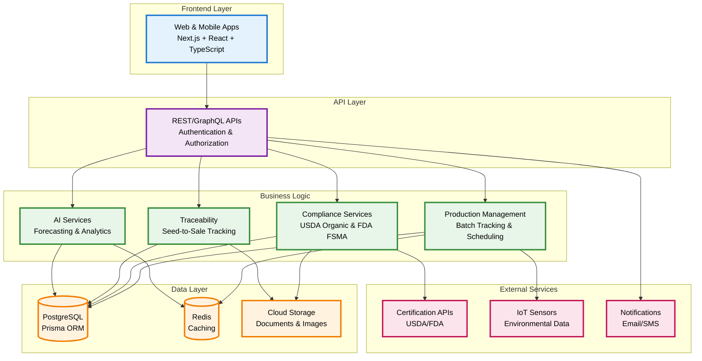

# 🌱 Organic Farm Management System (OFMS)

**Enterprise-grade farm management platform for organic operations**

[](https://github.com/yourusername/ofms)
[](https://github.com/yourusername/ofms/releases)
[](LICENSE)

---

OFMS is a unified, multi-tenant platform for organic farming operations. It enables complete traceability from seed to sale, simplifies compliance with USDA Organic and FDA FSMA standards, and provides actionable insights through integrated analytics and AI-assisted forecasting.

Built for farm owners, managers, and teams who want to:
- Track crops, batches, and inventory with confidence across multiple farms
- Streamline certification, inspection, and recall processes
- Make informed decisions using practical, real-time data and advanced analytics
- Coordinate teams and tasks securely across organizations
- Leverage AI for demand forecasting, disease detection, and operational recommendations

OFMS brings clarity, trust, and efficiency to modern organic agriculture at scale.

## 🏗️ **Architecture**



**Layered architecture: Frontend → API → Business Logic → Data → External Services**

## 🚀 **Quick Start**

```bash
# Clone and install
git clone <repository-url>
cd farm-app
npm install

# Setup database
cp .env.example .env
npx prisma migrate dev
npx prisma db seed

# Start development server
npm run dev
# Navigate to http://localhost:3005
```

### **Prerequisites**
- Node.js 18+
- PostgreSQL 14+
- Docker (optional, for Ollama AI)

### **Environment Setup**
```bash
# Development
npm run dev                 # Start development server (port 3005)
npm run test               # Run test suite
npm run lint:fix           # Fix linting issues

# Database
npm run db:setup           # Initialize database
npm run db:seed           # Seed test data
npm run db:integrity:check # Verify data integrity

# AI Features (optional)
docker run -d -p 11434:11434 --name ollama ollama/ollama
# Pull AI models: deepseek-r1, qwen3, mistral
```

### **Available Scripts**
- `npm run dev` - Development server
- `npm run build` - Production build
- `npm run test` - Unit tests
- `npm run test:e2e` - End-to-end tests
- `npm run db:backup` - Database backup
- `npm run style:check` - CSS compliance check

## 🌍 **Production Deployment**

### **Multi-Tenant Configuration**
```bash
# Create new farm
node scripts/create-new-farm.js \
  --farmName "Your Farm" \
  --ownerEmail "owner@yourfarm.com" \
  --businessName "Your Business LLC"

# Switch between farms (Global Admin)
# Available in UI: Farm selector in header
```

### ****
1. **Curry Island Microgreens** - 9 users, 119 batches
2. **Shared Oxygen Farms** - 4 users, 4 batches (Cannabis)

### **Deployment Commands**
```bash
# Production build
npm run build
npm run start

# Health checks
npm run db:health
npm run integrity:audit
```

## 🤖 **AI Features**

### **Local AI Integration**
- **DeepSeek-R1**: Advanced reasoning for crop planning and market analysis
- **Qwen3**: Vision analysis for disease detection and plant health
- **Mistral**: General-purpose text processing and recommendations

### **AI Capabilities**
- **Disease Detection**: 94% accuracy with organic treatment recommendations
- **Demand Forecasting**: 14-day predictions with confidence scoring
- **Market Intelligence**: Pricing optimization and competitive analysis
- **Crop Planning**: Resource optimization and yield maximization

## 📄 **License**

MIT License - see [LICENSE](LICENSE) for details


**🌱 Built for modern organic farming operations**  
*Enterprise-grade • Multi-tenant • AI-powered • Production-ready* 