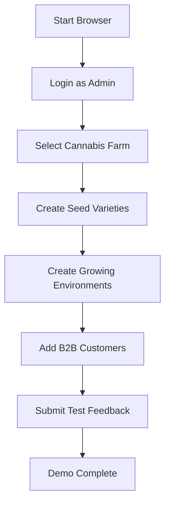

# OFMS Browser Automation

Browser automation scripts for the Organic Farm Management System using Playwright.

## 🚀 Quick Start

1. **Install Dependencies**
   ```bash
   npm install --save-dev @playwright/test
   npx playwright install
   ```

2. **Start Your OFMS App**
   ```bash
   npm run dev  # Make sure app is running on http://localhost:3000
   ```

3. **Run the Demo**
   ```bash
   node automation/ofms-data-entry.js
   ```

## 🎭 What the Automation Does

### Core Features
- **🔐 Auto Login** - Logs in with admin credentials
- **🏢 Farm Selection** - Switches between different farms
- **🌱 Seed Management** - Creates new seed varieties
- **🏠 Environment Setup** - Creates growing environments  
- **👥 Customer Management** - Adds B2B customers
- **💬 Feedback Submission** - Tests feedback system

### Demo Workflow


## 📝 Customization

### Change Login Credentials
```javascript
await automation.login('your-email@domain.com', 'your-password');
```

### Select Different Farm
```javascript
await automation.selectFarm('Curry Island Microgreens');
```

### Add Custom Data
```javascript
await automation.createSeedVariety({
    name: 'Custom Variety',
    scientificName: 'Scientific Name',
    supplier: 'Your Supplier',
    stockQuantity: 100,
    minStockLevel: 20,
    costPerUnit: 5.99,
    germinationRate: 0.95,
    daysToHarvest: 30
});
```

## 🔧 Advanced Usage

### Run in Headless Mode
```javascript
const automation = new OFMSAutomation();
// Edit the init() method to set headless: true
```

### Add Screenshots
```javascript
await this.page.screenshot({ path: 'screenshot.png' });
```

### Wait for Specific Elements
```javascript
await this.page.waitForSelector('.specific-class');
await this.page.waitForText('Expected Text');
```

### Handle Dynamic Content
```javascript
await this.page.waitForLoadState('networkidle');
await this.page.waitForFunction(() => document.querySelector('.loading') === null);
```

## 🎯 Use Cases

### 1. **Development Testing**
```bash
# Test new features automatically
node automation/ofms-data-entry.js
```

### 2. **Demo Data Population**
```javascript
// Populate demo farm with sample data
const demoData = SAMPLE_DATA.cannabis;
for (const seed of demoData.seeds) {
    await automation.createSeedVariety(seed);
}
```

### 3. **User Acceptance Testing**
```javascript
// Simulate real user workflows
await automation.login('user@farm.com', 'password');
await automation.selectFarm('Production Farm');
// ... perform user tasks
```

### 4. **Load Testing Setup**
```javascript
// Create multiple browser instances
const browsers = [];
for (let i = 0; i < 10; i++) {
    const automation = new OFMSAutomation();
    browsers.push(automation);
}
```

## 🛠️ Available Methods

| Method | Description | Example |
|--------|-------------|---------|
| `login(email, password)` | Log into OFMS | `await automation.login()` |
| `selectFarm(farmName)` | Switch farms | `await automation.selectFarm('My Farm')` |
| `createSeedVariety(data)` | Add seed variety | `await automation.createSeedVariety({...})` |
| `createGrowingEnvironment(data)` | Add environment | `await automation.createGrowingEnvironment({...})` |
| `createCustomer(data)` | Add B2B customer | `await automation.createCustomer({...})` |
| `submitFeedback(data)` | Submit feedback | `await automation.submitFeedback({...})` |

## 🚨 Error Handling

The script includes comprehensive error handling:

```javascript
try {
    await automation.runDemo();
} catch (error) {
    console.error('❌ Automation failed:', error);
    await automation.close();
}
```

## 🔍 Debugging

### Enable Slow Motion
```javascript
this.browser = await chromium.launch({ 
    headless: false,
    slowMo: 2000  // 2 second delay between actions
});
```

### Add Console Logs
```javascript
this.page.on('console', msg => console.log('PAGE LOG:', msg.text()));
```

### Take Screenshots on Errors
```javascript
catch (error) {
    await this.page.screenshot({ path: 'error-screenshot.png' });
    throw error;
}
```

## 📊 Sample Data Sets

Pre-configured data for different farm types:

- **Cannabis Cultivation**: Premium strains, dispensary customers
- **Microgreens**: Fast-growing varieties, restaurant customers  
- **Organic Vegetables**: Traditional crops, farmers market customers

Access via `SAMPLE_DATA.cannabis.seeds` or `SAMPLE_DATA.microgreens.customers`

## 🎪 Alternative Tools

If Playwright doesn't fit your needs:

- **Puppeteer**: `npm install puppeteer`
- **Selenium**: `npm install selenium-webdriver`  
- **Cypress**: `npm install cypress`

## 📚 Resources

- [Playwright Documentation](https://playwright.dev/)
- [Selectors Guide](https://playwright.dev/docs/selectors)
- [Auto-waiting](https://playwright.dev/docs/actionability)
- [Best Practices](https://playwright.dev/docs/best-practices)
