```mermaid
flowchart TD
    %% UI Layer
    subgraph UI["🌐 User Interface (Web & Mobile)"]
      A1["👩‍🌾 Farm Manager Dashboard"]
      A2["🛡️ Compliance Admin Panel"]
      A3["👀 Auditor/Inspector Portal"]
      A4["👷 Worker Mobile App"]
    end

    %% API Layer
    subgraph API["🟦 Next.js API Layer"]
      B1["/api/compliance/usda-organic"]
      B2["/api/compliance/fda-fsma"]
      B3["/api/traceability"]
      B4["/api/audit-log"]
      B5["/api/users & auth"]
      B6["/api/files (evidence uploads)"]
    end

    %% Business Logic
    subgraph Logic["🟩 Business Logic & Services"]
      C1["Compliance Service"]
      C2["Traceability Service"]
      C3["Audit Trail Service"]
      C4["Notification & Reminder Service"]
      C5["Role & Permission Service"]
      C6["File Storage Service"]
    end

    %% Data Layer
    subgraph DB["🟫 Database & Storage"]
      D1["PostgreSQL (Prisma)"]
      D2["AWS S3 / Cloud Storage"]
      D3["Redis / Caching"]
    end

    %% External Integrations
    subgraph EXT["🔗 External Integrations"]
      E1["USDA NOP Certifier API"]
      E2["FDA Data Dashboard"]
      E3["Lab Results API"]
      E4["Email/SMS Gateway"]
      E5["SSO/Identity Provider"]
    end

    %% Data Flows
    A1-->|REST/GraphQL|B1
    A2-->|REST/GraphQL|B2
    A3-->|REST/GraphQL|B4
    A4-->|REST/GraphQL|B1
    B1-->|Service Calls|C1
    B2-->|Service Calls|C1
    B3-->|Service Calls|C2
    B4-->|Service Calls|C3
    B5-->|Service Calls|C5
    B6-->|Service Calls|C6
    C1-->|ORM|D1
    C2-->|ORM|D1
    C3-->|ORM|D1
    C4-->|Events|D3
    C6-->|File Upload|D2
    C4-->|Notify|E4
    C5-->|SSO|E5
    C1-->|Cert Validation|E1
    C1-->|FDA Report|E2
    C1-->|Lab Data|E3

    %% Legend
    classDef ui fill:#e3f2fd,stroke:#2196f3,stroke-width:2px;
    classDef api fill:#e1bee7,stroke:#7b1fa2,stroke-width:2px;
    classDef logic fill:#e8f5e9,stroke:#388e3c,stroke-width:2px;
    classDef db fill:#fff3e0,stroke:#f57c00,stroke-width:2px;
    classDef ext fill:#fce4ec,stroke:#c2185b,stroke-width:2px;
    class UI,A1,A2,A3,A4 ui;
    class API,B1,B2,B3,B4,B5,B6 api;
    class Logic,C1,C2,C3,C4,C5,C6 logic;
    class DB,D1,D2,D3 db;
    class EXT,E1,E2,E3,E4,E5 ext;
```

**Legend:**
- Blue: UI Layer
- Purple: API Layer
- Green: Business Logic
- Orange: Data Layer
- Pink: External Integrations

> *This diagram represents a modern, modular, and secure architecture for compliance-focused farm management SaaS platforms.*
